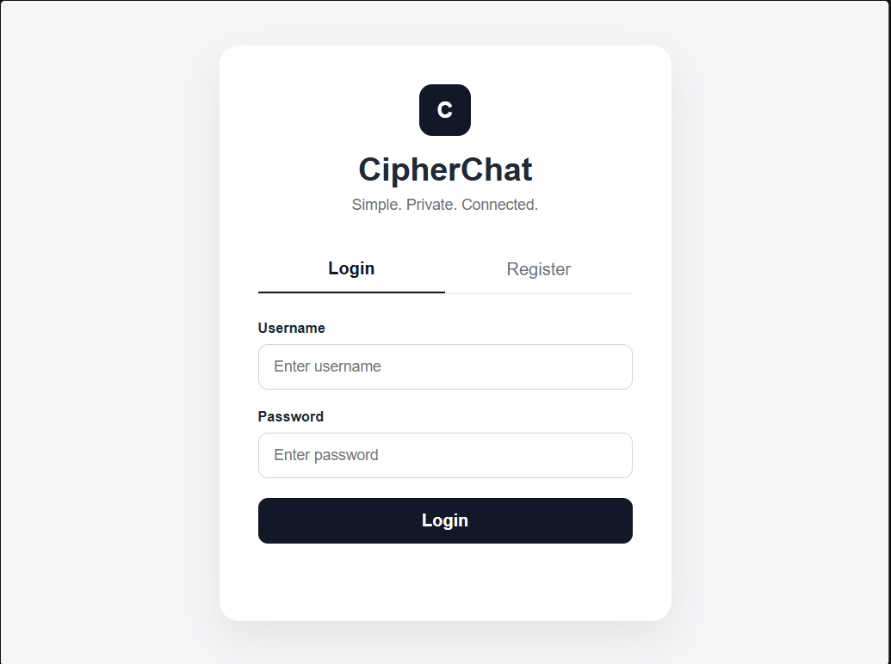
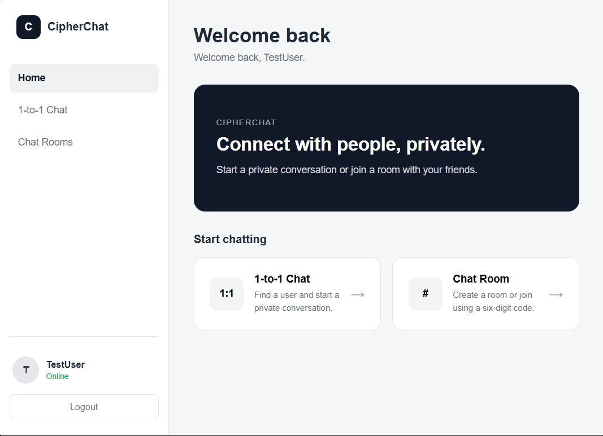
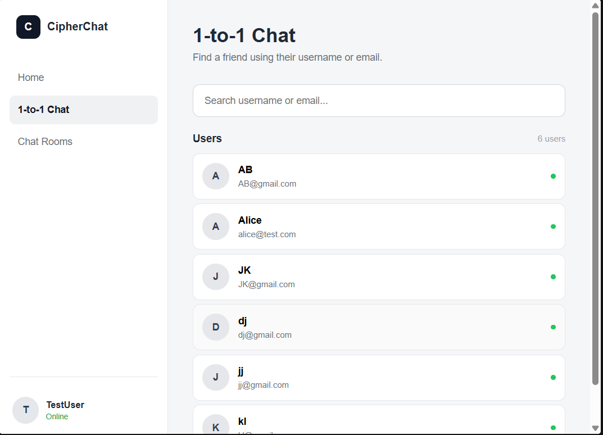
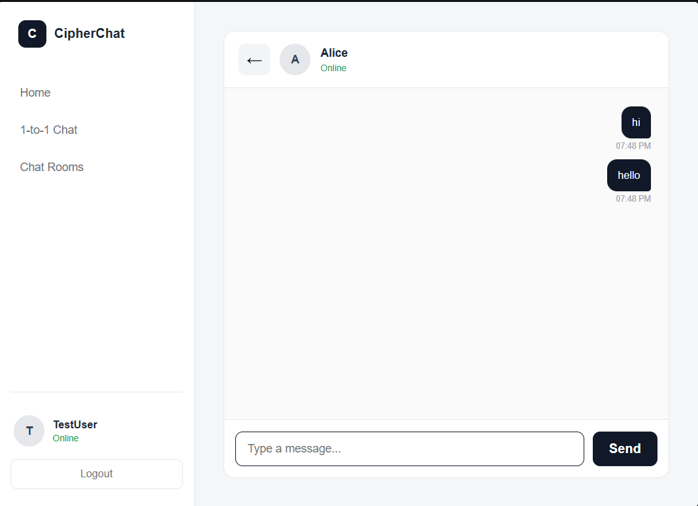
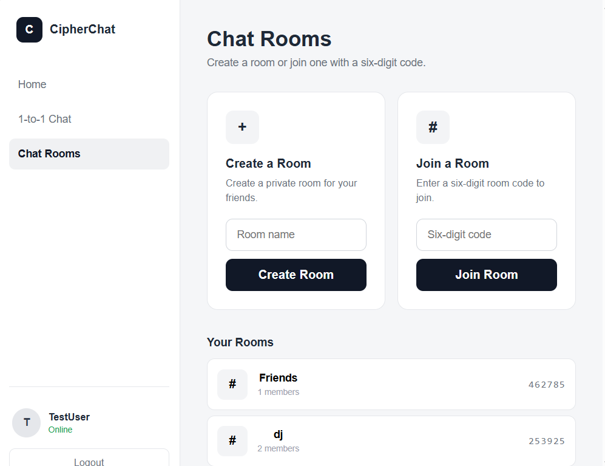
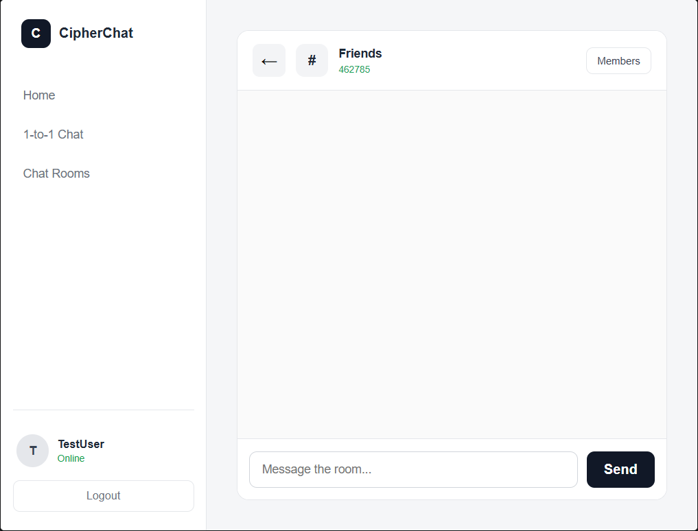
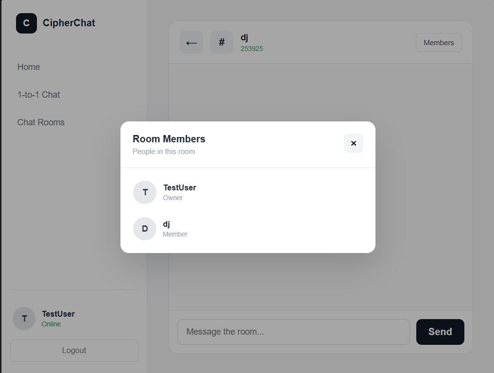

# CipherChat

> A full-stack chat application built to learn and demonstrate Python socket programming, TCP client-server communication, authentication, SQLite database management, Flask API development, and frontend web development.


---
## 🌐 Live Demo

🔗 **[Launch CipherChat](https://cipherchat-sigma.vercel.app)**

> **Note:** The frontend is hosted on Vercel, and the backend runs on Render. If the backend has been idle, its first request may take some time while the service starts up. If the application doesn't respond immediately, wait briefly and try again.

## 📌 Overview

**CipherChat** is a full-stack chat application developed as a practical learning project around networking, backend development, databases, authentication, authorization, and web application architecture.

The project started with a Python TCP socket-based client-server chat system and was extended with a Flask API, SQLite persistence, authentication, private messaging, and browser-based chat rooms.

The current application supports:

- User registration and login
- Password hashing and secure password storage
- User discovery
- One-to-one private messaging
- Persistent private message history
- Chat room creation and joining
- Room member management
- Room-based messaging
- Backend API development with Flask
- PostgreSQL database integration
- A browser-based interface built with HTML, CSS, and JavaScript
- A Python TCP socket-based client-server chat implementation

---

## ✨ Features

### 🔐 Authentication

- User registration
- User login
- Username validation
- Email validation
- Password validation
- Password hashing using PBKDF2-HMAC-SHA256
- Random password salt
- Duplicate username protection
- Duplicate email protection
- Duplicate online-user protection

---

### 💬 Private Messaging

- One-to-one private conversations
- User search
- Send private messages
- Load private message history
- Persistent private messages using SQLite
- Conversation history remains available after reopening the conversation

---

### 👥 Chat Rooms

- Create chat rooms
- Six-digit room codes
- Join rooms using room codes
- Room owner/member roles
- Maximum room membership support
- Room member listing
- Persistent room membership
- Backend-driven room list
- Room message history
- Persistent room messages

---

### 🛡️ Room Security

Room access is protected using membership checks.

Protected operations include:

- Room details access
- Room message history access
- Room message sending

A user who is not a member of a room cannot access its protected room information or send/read room messages through the protected API endpoints.

---

### 🌐 Web Frontend

- Login interface
- Registration interface
- Home dashboard
- User search
- Private chat interface
- Chat room interface
- Create room interface
- Join room interface
- Room members modal
- Message bubbles
- Responsive layout
- Navigation
- Logout functionality
- Backend-connected user list
- Backend-connected private messaging
- Backend-connected room list
- Backend-connected room messaging

---

## 🏗️ Architecture

```text
                     CipherChat
                         │
                         ▼
              ┌────────────────────┐
              │   Web Frontend     │
              │ HTML / CSS / JS    │
              └─────────┬──────────┘
                        │
                        │ HTTP / JSON
                        ▼
              ┌────────────────────┐
              │    Flask API       │
              │    api/app.py      │
              └─────────┬──────────┘
                        │
                        ▼
              ┌────────────────────┐
              │ Python Application │
              │ Networking Logic   │
              └─────────┬──────────┘
                        │
                        ▼
              ┌────────────────────┐
              │      SQLite        │
              │ cipherchat.db      │
              └────────────────────┘
```

The project also contains a Python TCP client/server implementation for learning and demonstrating socket-based networking.

---

## 🧰 Technology Stack

### Backend

- Python
- TCP Socket Programming
- Python `socket`
- Threading
- Flask
- REST-style HTTP API

### Database

- SQLite
- SQL
- Persistent message storage
- User authentication storage
- Room and membership storage

### Frontend

- HTML5
- CSS3
- JavaScript
- Fetch API
- DOM manipulation

### Security

- PBKDF2-HMAC-SHA256 password hashing
- Random password salts
- Input validation
- Room membership authorization
- Protected room message access

### Development Tools

- Git
- GitHub
- Visual Studio Code

---

## 📂 Project Structure

```text
CipherChat/
│
├── api/
│   └── app.py
│
├── client/
│   └── client.py
│
├── server/
│   ├── server.py
│   └── auth.py
│
├── database/
│   ├── database.py
│   └── cipherchat.db
│
├── frontend/
│   ├── index.html
│   ├── style.css
│   └── script.js
│
├── docs/
│
├── tests/
│
├── screenshots/
│   ├── s1-login.png
│   ├── s3-dashboard.png
│   ├── s4-users.png
│   ├── s5-private-chat.png
│   ├── s6-rooms.png
│   ├── s8-room-chat.png
│   └── s9-room-members.png
│
├── requirements.txt
├── .gitignore
└── README.md
```

---

## ⚙️ Installation

### 1. Clone the repository

```bash
git clone https://github.com/Pranay-Pandurang-Patil/CipherChat.git
```

### 2. Enter the project directory

```bash
cd CipherChat
```

### 3. Create a virtual environment

```bash
python -m venv venv
```

### 4. Activate the virtual environment

#### Windows

```bash
venv\Scripts\activate
```

#### Linux / macOS

```bash
source venv/bin/activate
```

### 5. Install dependencies

```bash
pip install -r requirements.txt
```

---

## ▶️ Running the Application

### Start the Flask API

From the project root:

```bash
python api/app.py
```

The API runs by default at:

```text
http://127.0.0.1:8000
```

### Start the frontend

Open:

```text
frontend/index.html
```

using a local development server such as **VS Code Live Server**.

The frontend communicates with the Flask API running on port `8000`.

---

## 🔑 Authentication Flow

```text
Registration
     │
     ▼
Validate user information
     │
     ▼
Generate password salt
     │
     ▼
Hash password
     │
     ▼
Store user in SQLite
     │
     ▼
Login
     │
     ▼
Verify password
     │
     ▼
Open CipherChat
```

---

## 💬 Private Messaging Flow

```text
User selects another user
          │
          ▼
Frontend sends message
          │
          ▼
Flask API
          │
          ▼
SQLite database
          │
          ▼
Message stored
          │
          ▼
Conversation history loaded
```

---

## 👥 Room Flow

### Create Room

```text
User
 │
 ▼
Create Room
 │
 ▼
Flask API
 │
 ▼
Generate room code
 │
 ▼
Create room in SQLite
 │
 ▼
Add creator as owner
 │
 ▼
Room available to user
```

### Join Room

```text
User enters room code
          │
          ▼
POST /api/rooms/join
          │
          ▼
Validate room
          │
          ▼
Add user to room_members
          │
          ▼
Load room details
          │
          ▼
Open room
```

---

## 🛡️ Room Authorization Flow

```text
User requests room resource
          │
          ▼
Extract username
          │
          ▼
Check room membership
          │
       ┌──┴──┐
       │     │
     Member  Not Member
       │     │
       ▼     ▼
    Allow   HTTP 403
```

Protected room operations include:

```text
GET  /api/rooms/<room_code>
GET  /api/rooms/<room_code>/messages
POST /api/rooms/<room_code>/messages
```

---

## 🔌 API Endpoints

### Health Check

```http
GET /api/health
```

### Authentication

#### Register

```http
POST /api/register
```

#### Login

```http
POST /api/login
```

### Users

#### Get Users

```http
GET /api/users
```

### Private Messages

#### Get Private Messages

```http
GET /api/private-messages
```

#### Send Private Message

```http
POST /api/private-messages
```

### Rooms

#### Create Room

```http
POST /api/rooms
```

#### Join Room

```http
POST /api/rooms/join
```

#### Get User Rooms

```http
GET /api/user-rooms/<username>
```

#### Get Room Details

```http
GET /api/rooms/<room_code>?username=<username>
```

#### Get Room Messages

```http
GET /api/rooms/<room_code>/messages?username=<username>
```

#### Send Room Message

```http
POST /api/rooms/<room_code>/messages
```

---

## 🗄️ Database Structure

CipherChat uses SQLite for persistent storage.

The database contains the core entities required for:

- Users
- Rooms
- Room members
- Messages

Conceptually:

```text
Users
 │
 ├───────────────┐
 │               │
 ▼               ▼
Private       Room Members
Messages          │
                  ▼
                Rooms
                  │
                  ▼
             Room Messages
```

---

## 🧪 Testing

The current application has been manually tested for:

- User registration
- User login
- Private user search
- Private messaging
- Private message persistence
- Room creation
- Room joining
- Backend-driven room listing
- Room member listing
- Room messaging
- Room message persistence
- Room reopening
- Unauthorized room access protection
- Unauthorized room message access protection
- Unauthorized room message sending protection

---

## 📸 Screenshots

### 🔐 Login



### 🏠 Dashboard



### 👥 Users



### 💬 Private Chat



### 🏘️ Rooms



### 💬 Room Chat



### 👤 Room Members



---

## 🔒 Security Notes

CipherChat implements several foundational security mechanisms:

- Password hashing using PBKDF2-HMAC-SHA256
- Random password salts
- Input validation
- Duplicate account protection
- Room membership checks
- Protected room details
- Protected room message history
- Protected room message sending

### Current Authentication Model

The current browser application passes the logged-in username to API endpoints rather than using a production-grade session or token authentication system.

Therefore, the project should be considered a **learning/portfolio application**, not a production-ready messaging service.

---

## 🚀 Project Status

**Core application development: Complete ✅**

The current implementation includes:

- Authentication
- Private messaging
- SQLite persistence
- Room creation
- Room joining
- Room membership
- Room messaging
- Backend-driven room lists
- Protected room access
- Browser frontend
- Flask API integration

The project is now in the **final documentation and GitHub polishing stage**.

---

## 🎯 Learning Objectives

CipherChat was developed to gain practical experience with:

1. Python socket programming
2. TCP client-server communication
3. Multi-client communication
4. Threading and multithreading
5. Message framing
6. Receive buffer handling
7. SQLite database management
8. Authentication
9. Password hashing
10. Flask API development
11. REST-style API communication
12. HTML/CSS/JavaScript frontend development
13. Frontend-backend integration
14. Authorization and access control
15. Git and GitHub
16. Full-stack application structure

---

## 🧠 Key Concepts Demonstrated

### Networking

- TCP
- Sockets
- Client-server architecture
- Message framing
- Receive buffers
- Multi-client communication
- Connection handling

### Backend Development

- Flask routing
- JSON requests/responses
- API design
- Database integration
- Input validation
- Authorization checks

### Database

- SQLite
- SQL queries
- Relationships
- User records
- Room membership
- Message persistence

### Frontend

- DOM manipulation
- Event handling
- Fetch API
- Async JavaScript
- Dynamic UI rendering
- Form handling

### Security

- Password hashing
- Password salts
- Input validation
- Membership authorization
- Protected resources

---

## 🛠️ Future Improvements

Possible future improvements include:

- Token-based authentication
- Secure session management
- WebSocket-based real-time browser messaging
- HTTPS deployment
- Improved error handling
- Automated test coverage
- Rate limiting
- Better API authentication
- Message timestamps
- Online/offline presence
- Message deletion
- Message editing
- Typing indicators
- Production database migration
- Cloud deployment

These are optional extensions and are not required for the current core project.

---

## 📚 Project Purpose

CipherChat was built as a practical learning and portfolio project.

Rather than focusing only on creating a chat interface, the project explores how different components of a communication system work together:

```text
Networking
    +
Backend
    +
Database
    +
Authentication
    +
Authorization
    +
Frontend
    =
CipherChat
```

---

## 👨‍💻 Author

**Pranay Patil**

CSE Student  
KLS Gogte Institute of Technology, Belagavi

GitHub:

https://github.com/Pranay-Pandurang-Patil

---

## 📄 License

This project is licensed under the **MIT License**.

See the `LICENSE` file for details.

---

## ⭐ Acknowledgement

CipherChat was developed as a hands-on project to understand the fundamentals of computer networking, backend development, databases, authentication, security, and frontend-backend integration.

If you find the project useful for learning, consider giving the repository a ⭐ on GitHub.

---

## 📌 Final Project Summary

```text
CipherChat
│
├── Python TCP Networking
├── Multi-client Communication
├── Flask REST API
├── SQLite Persistence
├── Authentication
├── Password Hashing
├── Private Messaging
├── Chat Rooms
├── Room Membership
├── Authorization
├── HTML/CSS/JavaScript Frontend
└── Git/GitHub
```

**Status: Core functionality complete ✅**
